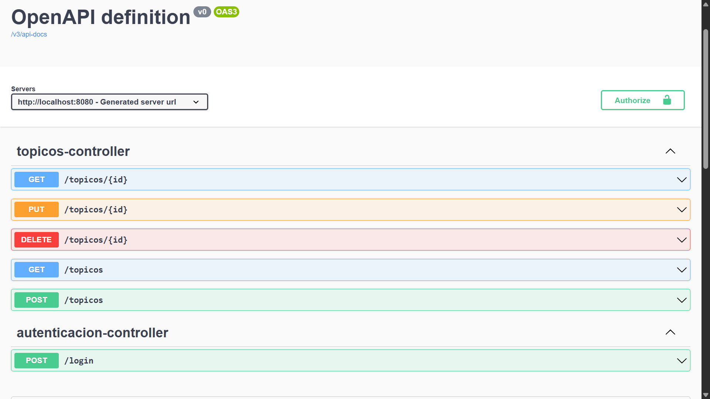

# 🗂️ ForoHub — API REST con Spring Boot


---

## 📖 Descripción

**ForoHub** es una API REST desarrollada como parte del challenge de Alura Latam. Simula el backend de un foro donde los usuarios autenticados pueden crear, listar, actualizar y eliminar tópicos de discusión organizados por cursos.

---

## 🚀 Tecnologías utilizadas

| Tecnología | Versión |
|---|---|
| Java | 17 |
| Spring Boot | 3.4.5 |
| Spring Security | 6.x |
| Spring Data JPA | 3.x |
| MySQL | 8.0 |
| Flyway | 10.x |
| Auth0 Java JWT | 4.5.1 |
| SpringDoc OpenAPI (Swagger) | 2.8.5 |
| Lombok | Latest |

---

## 📦 Funcionalidades

- ✅ Registro y listado paginado de tópicos
- ✅ Detalle, actualización y eliminación de tópicos
- ✅ Validación de tópicos duplicados (título + mensaje)
- ✅ Autenticación con JWT (JSON Web Token)
- ✅ Protección de endpoints con Spring Security
- ✅ Migraciones de base de datos con Flyway
- ✅ Documentación interactiva con Swagger UI

---

## 📸 Capturas

### Documentación Swagger UI


### Diagrama de entidades


---

## 🗄️ Modelo de datos

```
Usuario ──< usuario_perfiles >── Perfil
Usuario ──< Topico
Curso   ──< Topico
Topico  ──< Respuesta
```

---

## 🔐 Autenticación

La API utiliza autenticación stateless con **JWT**. Para acceder a los endpoints protegidos:

1. Autenticarse en `POST /login` con correo y contraseña
2. Copiar el token JWT recibido en el response
3. Incluirlo en el header de cada request:
```
Authorization: Bearer <token>
```

---

## 📋 Endpoints

### Autenticación
| Método | URI | Descripción | Auth |
|---|---|---|---|
| POST | `/login` | Iniciar sesión | ❌ |

### Tópicos
| Método | URI | Descripción | Auth |
|---|---|---|---|
| POST | `/topicos` | Registrar tópico | ✅ |
| GET | `/topicos` | Listar tópicos paginados | ✅ |
| GET | `/topicos/{id}` | Detalle de un tópico | ✅ |
| PUT | `/topicos/{id}` | Actualizar tópico | ✅ |
| DELETE | `/topicos/{id}` | Eliminar tópico | ✅ |

### Parámetros opcionales — GET /topicos
| Parámetro | Tipo | Descripción |
|---|---|---|
| `nombreCurso` | String | Filtra por nombre de curso |
| `anio` | Integer | Filtra por año de creación |

---

## ▶️ Cómo ejecutar el proyecto

### Requisitos previos
- Java 17
- Maven
- MySQL 8.0

### Pasos

1. Clonar el repositorio:
```bash
git clone https://github.com/Alexis1005/foro-hub-alura-challenge.git
cd foro-hub-alura-challenge
```

2. Crear la base de datos en MySQL:
```sql
CREATE DATABASE forohub;
```

3. Configurar `application.properties`:
```properties
spring.datasource.url=jdbc:mysql://localhost:3306/forohub
spring.datasource.username=tu_usuario
spring.datasource.password=tu_contraseña
api.security.token.secret=${JWT_SECRET:tu_secret_aqui}
```

4. Ejecutar el proyecto:
```bash
./mvnw spring-boot:run
```

Flyway ejecutará automáticamente las migraciones y creará las tablas.

---

## 📚 Documentación interactiva

Con la aplicación corriendo, accedé a Swagger UI:

```
http://localhost:8080/swagger-ui.html
```

Podés probar todos los endpoints directamente desde el navegador. Para endpoints protegidos, hacé click en **Authorize** 🔒 e ingresá el token JWT.

---

## 📁 Estructura del proyecto

```
src/main/java/com/challenge/foroHub/
├── controller/
│   ├── TopicosController.java
│   └── AutenticacionController.java
├── domain/
│   ├── cursos/
│   ├── perfiles/
│   ├── respuestas/
│   ├── topicos/
│   │   └── dto/
│   └── usuarios/
│       └── dto/
├── infra/
│   ├── security/
│   │   ├── SecurityConfig.java
│   │   ├── SecurityFilter.java
│   │   └── TokenService.java
│   └── springDoc/
│       └── SpringDocConfiguration.java
├── repository/
└── service/
    ├── TopicoService.java
    └── AutenticacionService.java
```

---

## 👤 Autor

Desarrollado por **Alexis Vespa** como parte del Challenge Back End de [Alura Latam](https://www.aluracursos.com/).

